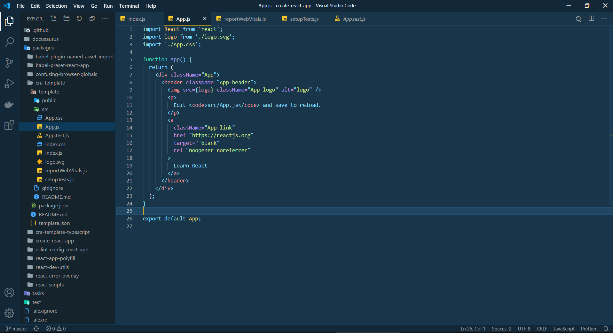
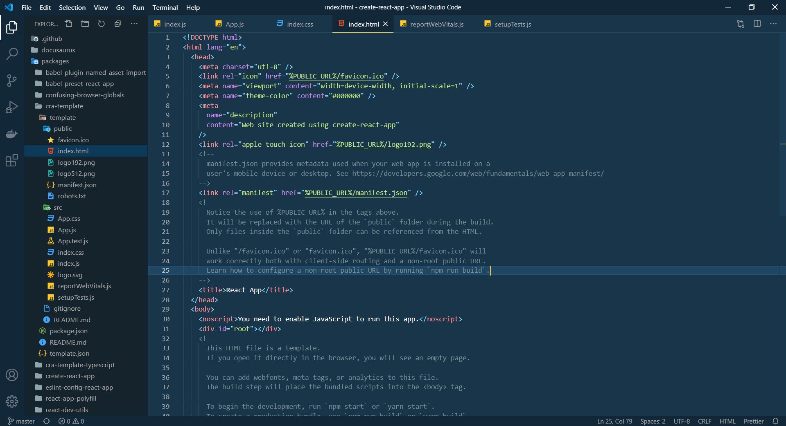

# Cobalt One Dark+

Combination of Cobalt2 workbench theme + One Dark colors for Visual Studio Code.

## Screenshots

### JavaScript

### HTML

## Credits
- Cobalt2 by Wes Bos: https://github.com/wesbos/cobalt2
- Atom One Dark Theme: https://github.com/atom/one-dark-syntax
- 
Icons made by <a href="https://www.flaticon.com/authors/freepik" title="Freepik">Freepik</a> from <a href="https://www.flaticon.com/" title="Flaticon">www.flaticon.com</a>
